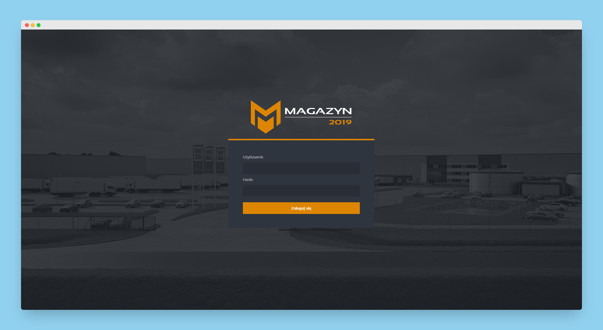
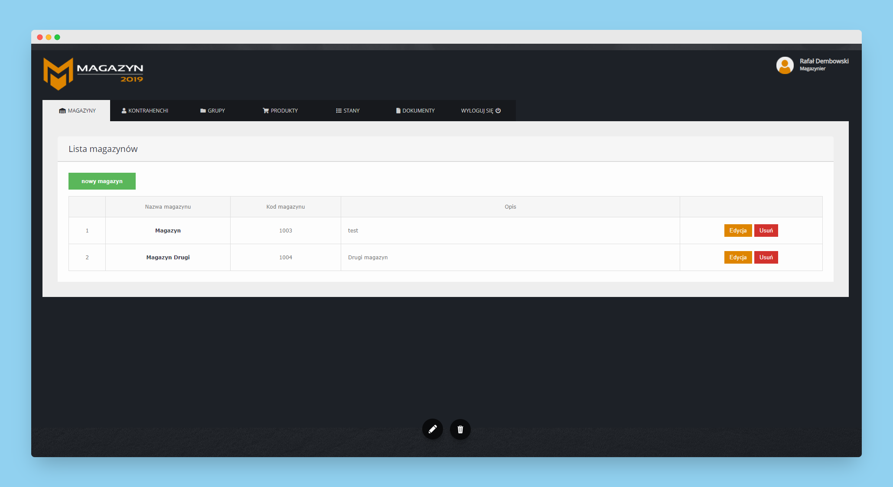
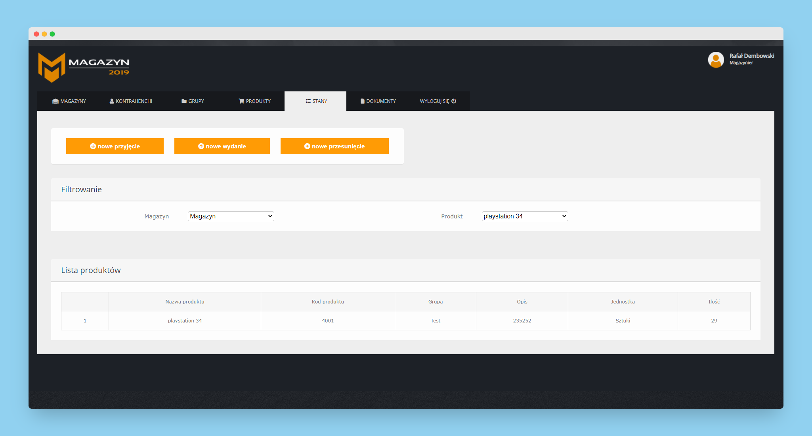
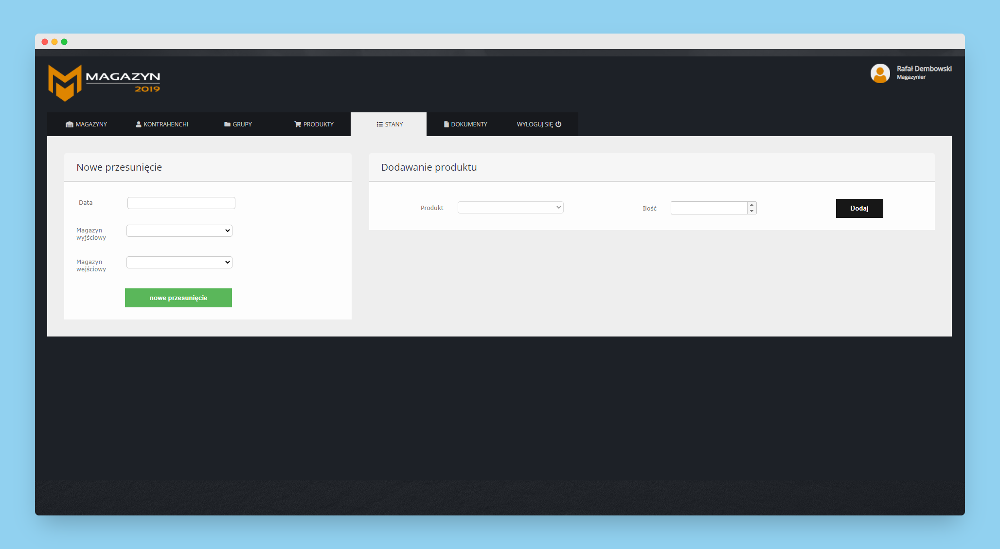
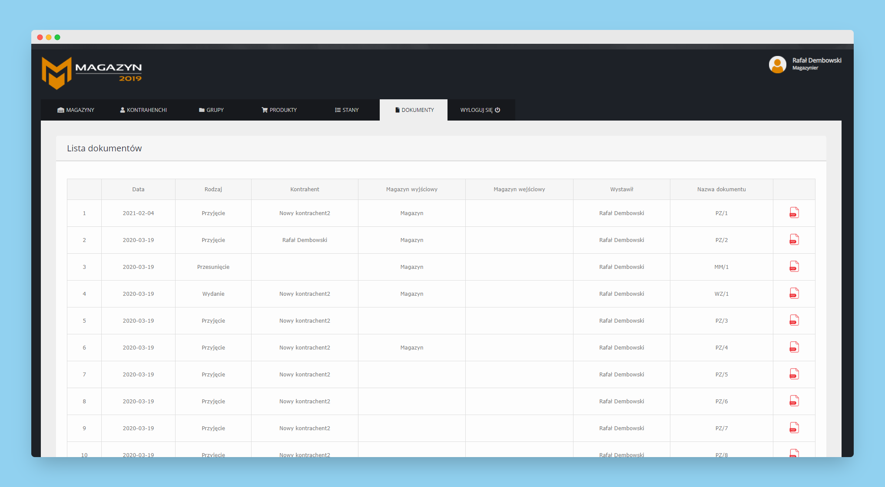

# Magazyn2019
>Magazyn2019 is a web application for warehouses developed using asp .net and web api using by jquery. The application allows you to track product information, move products, create pdf documents and much more. 

## Table of contents
* [General info](#general-info)
* [Technologies](#technologies)
* [Features](#features)
* [Solution Projects](#solution-projects)
* [Screenshots](#screenshots)

## General info
Magazyn2019 is a web application that helps with logistics work for warehouse workers. The application enabled me to learn web api and handle requests using jquery. 
The application was developed by me using c#, asp .net mvc, jquery and entity framework.

## Technologies
* .NET Framework 4.7.2
* ASP .NET MVC
* C#
* Entity framework
* jQuery
* Html
* Css
* Transact-SQL

## Features
List of features ready and TODOs for future development
* Session-based login system
* Adding, editing and deleting warehouses
* Adding, editing and deleting contractors
* Adding, editing and deleting products
* Creating documents in pdf format
* Viewing the contents of selected warehouses
* Filtering the content of warehouses
* Adding new products to the warehouse
* Releasing products from the warehouse
* Moving products between warehouses
* Viewing generated documents.

To-do list:
* Responsive user dashboard

## Screenshots

